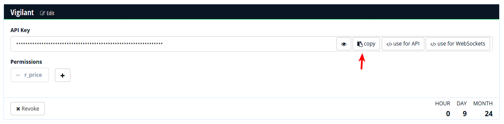
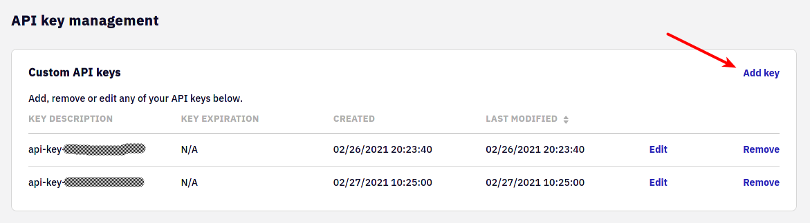

# Configuration

Unfortunately we need to configure a few things before you can start automatic trading with this software. Most configuration is done in a [YAML](https://yaml.org/) file. Create this file and open it in a text editor. We will talk you through the necessary steps and show snippets to put into. Depending on your platform, the path should be this:

| Platform | Location |
| --- | --- |
| Linux | `~/.config/vigilant-crypto-snatch/config.yml` |
| Windows | `C:\Users\<User>\Application Data\Martin Ueding\vigilant-crypto-snatch\config.yml` |
| macOS | `~/Library/Application Support/vigilant-crypto-snatch/config.yml`

## Historic price API

In order to find a drop in the price, we need to know the historic price at a given point. We use Crypto Compare for that as they provide a free API. Go to [their website](https://min-api.cryptocompare.com/pricing) and create an API key.

> 

And retrieve your API key:

> 

In the configuration file then add the following:

```yaml
cryptocompare:
  api_key: 'your API key here'
```

## Marketplaces

We currently support two marketplaces, [Bitstamp](https://bitstamp.net/) and [Kraken](https://kraken.com). You only have to configure one of them, but you can also configure both. When you start the program, you can just choose which marketplace you want to use today.

### Bitstamp

In order to use Bitstamp, you need to set up an API key with them that has the correct permissions to trade with. Go to the *settings* menu and create a new key.

> 

Put this API key into the configuration file.

```yaml
bitstamp:
  username: 'username here'
  key: 'key here'
  secret: 'secret here'
```

### Kraken

The Kraken Python library that we use has it's own configuration files. First you have to create a file at `~/.config/clikraken/settings.ini` and insert the following there:

```ini
[clikraken]
trading_agreement=agree
```

Then on the website create an API key which has the permission to trade. Navigate to the API settings:


There you need to create a new API key:



Be sure to select the _Create & Modify Orders_ permission such that the program can actually execute orders. Give the least amount of permissions, you certainly don't want _Withdraw Funds_.


You will get an API key and an associated secret. In the file `~/.config/clikraken/kraken.key` you must have two lines, the first will be API key and the second will be the secret, like this:

```
APIKEY
secret
```

There is nothing to add to our main configuration file.

## Triggers

You can define as many triggers as you would like. First you should set the polling interval that the main loop should use. It will wait this many seconds before checking again. For testing we found that 5 seconds is a good value, for production use 60 seconds should be absolutely sufficient.

```yaml
sleep: 60
```

We have two types of triggers: Drop triggers and just timers.

All timers have a cooldown such that they are not executed again and again. The cooldown is the same as the checking interval.

### Drop triggers

The drop trigger will fire when the price has dropped by a certain percentage compared to a reference at an earlier time. You can choose the delay and the drop percentage as you like. It might make sense to have larger drops when the time period is longer.

Say we want to have three triggers, two for Bitcoin and one for Etherum. When it drops by 5 % within 60 minutes, we want to buy for 25 EUR. If it drops by 15 % within 24 hours, we want to buy for 100 EUR. And for Etherum I just want the first trigger. This is an off-the-cuff example, think about the triggers that you want to have yourself. In the configuration it would look like this:

```yaml
triggers:
  - { coin: btc, fiat: eur, minutes: 60, drop: 5, volume_fiat: 25.00 }
  - { coin: btc, fiat: eur, minutes: 1400, drop: 15, volume_fiat: 100.00 }
  - { coin: eth, fiat: eur, minutes: 60, drop: 4.5, volume_fiat: 25.00 }
```

You can specify a decimal number for the drop percentage, just be aware that it must contain a decimal point instead of a decimal comma.

### Timers

If the market is steadily rising, there won't be drops. We still want to make use of the *dollar cost average* effect. For this we want to have a simple timer that doesn't have any other dependencies. If we want to buy Bitcoin for 75 EUR every 14 days, we can use this:

```yaml
timers:
  - { coin: btc, fiat: eur, minutes: 20160, volume_fiat: 75.00 }
```

## Telegram notifications

Optionally you can set up notifications via Telegram. This is not required, but a nice extra to allow monitoring from anywhere.

First you have to create a bot by talking to [@botfather](https://t.me/botfather). It will lead you through a couple of steps:

1. Type `/start` to initiate the bot creation.
2. Then type `/newbot` to create your bot.
3. It will ask you for the name of the bot. You can just use “vigilant-crypto-snatch” or something else.
4. Next it will ask for a username of the bot. This is a technical thing, so it doesn't need to be pretty. It needs to be unique and end with `bot`. So perhaps use something like `vigilant_0f8704a83991_bot`, where you just make up your own random letters.

It will give you an access token that you can use for the API. Enter that token into the configuration file:

```yaml
telegram:
  token: 'Your bot token here'
  level: info
```

You will need to write a message to the bot in order to open a direct conversation with it. This is necessary such that the bot can reply to you.

The `level` specified the messages that you want to receive. `info` gives sensible information, if you only want to receive information when something goes wrong, use `warning`. See the section in [running](running.md) for more details.

If the Telegram bot token is set up correctly, you will receive messages like this:

> 

The severity of messages is color-coded with an emoji according to this mapping:

Symbol | Severity
:---: | :---
🔴 | Critical
🟠 | Error
🟡 | Warning
🟢 | Info
🔵 | Debug

The logging level is set to *Info* by default. You must not set it to *Debug* as sending a Telegram message will produce more debug messages. The program will crash with an infinite recursion.