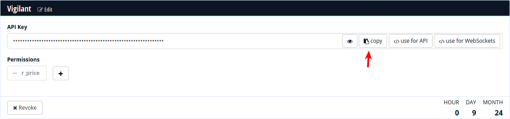

# General Configuration

Unfortunately we need to configure a few things before you can start automatic trading with this software. Most configuration is done in a [YAML](https://yaml.org/) file. It is a syntax for hierarchical data and relies on indentation to show the hierarchy.

The configuration file needs to be created with a (programmer's) text editor. We will talk you through the necessary steps and show snippets to put into. Depending on your platform, the path should be this:

| Platform | Location |
| --- | --- |
| Linux | `~/.config/vigilant-crypto-snatch/config.yml` |
| Windows | `C:\Users\<User>\Application Data\Martin Ueding\vigilant-crypto-snatch\config.yml` |
| macOS | `~/Library/Application Support/vigilant-crypto-snatch/config.yml`

This page does not contain all the necessary configuration steps, see the navigation for further pages on _marketplaces_ and _triggers_.

## Polling interval

First you should set the polling interval that the main loop should use. It will wait this many seconds before checking again. For testing we found that 5 seconds is a good value, for production use it doesn't need to be that fine grained. Many people use 60 seconds, but one can also use a whole hour.

```yaml
sleep: 60
```

## Historic price API

In order to find a drop in the price, we need to know the historic price at a given point. We use Crypto Compare for that as they provide a free API. Go to [their website](https://min-api.cryptocompare.com/pricing) and create an API key.

> 

And retrieve your API key:

> 

In the configuration file then add the following:

```yaml
cryptocompare:
  api_key: "your API key here"
```

## Telegram notifications

Optionally you can set up notifications via Telegram. This is not required, but a nice extra to allow monitoring from anywhere.

First you have to create a bot by talking to [@botfather](https://t.me/botfather). It will lead you through a couple of steps:

1. Type `/start` to initiate the bot creation.
2. Then type `/newbot` to create your bot.
3. It will ask you for the name of the bot. You can just use “vigilant-crypto-snatch” or something else.
4. Next it will ask for a username of the bot. This is a technical thing, so it doesn't need to be pretty. It needs to be unique and end with `bot`. So perhaps use something like `vigilant_0f8704a83991_bot`, where you just make up your own random letters.

It will give you an access token that you can use for the API. Enter that token into the configuration file:

```yaml
telegram:
  token: "Your bot token here"
  level: info
```

You will need to write a message to the bot in order to open a direct conversation with it. This is necessary such that the bot can reply to you.

The `level` specified the messages that you want to receive. `info` gives sensible information, if you only want to receive information when something goes wrong, use `warning`. See the section in [running](../usage/general.md) for more details.

If the Telegram bot token is set up correctly, you will receive messages like this:

> 

The severity of messages is color-coded with an emoji according to this mapping:

Symbol | Severity
:---: | :---
🔴 | Critical
🟠 | Error
🟡 | Warning
🟢 | Info
🔵 | Debug

The logging level is set to *Info* by default.