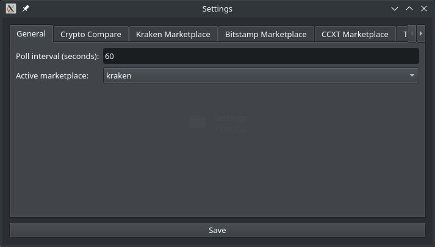

# General Configuration

Unfortunately we need to configure a few things before you can start automatic trading with this software. These pages will show the configuration options for both the GUI and the command line. In the GUI you fill need to use *File* → *Settings* to open the settings dialog.

This page does not contain all the necessary configuration steps, also see the navigation for further pages on _marketplaces_, _triggers_ and _notifications_.

## Configuration file for command line

If you want to use the command line, and *not* the graphical user interface, you will need to create a configuration file. The GUI will automatically create that for you, so this is only necessary when you do not want to or cannot use the GUI. The configuration is done in a [YAML](https://yaml.org/) file. It is a syntax for hierarchical data and relies on indentation to show the hierarchy.

The configuration file needs to be created with a (programmer's) text editor. We will talk you through the necessary steps and show snippets to put into. Depending on your platform, the path should be this:

| Platform | Location |
| --- | --- |
| Linux | `~/.config/vigilant-crypto-snatch/config.yml` |
| Windows | `C:\Users\<User>\Application Data\Martin Ueding\vigilant-crypto-snatch\config.yml` |
| macOS | `~/Library/Application Support/vigilant-crypto-snatch/config.yml`

## Polling interval

First you should set the polling interval that the main loop should use. It will wait this many seconds before checking again. For testing we found that 5 seconds is a good value, for production use it doesn't need to be that fine grained. Many people use 60 seconds, but one can also use a whole hour.

In the GUI you can set this in the first tab.



For the configuration file you enter it like this:

```yaml
sleep: 60
```

## Historic price API

In order to find a drop in the price, we need to know the historic price at a given point. We use Crypto Compare for that as they provide a free API. Go to [their website](https://min-api.cryptocompare.com/pricing) and create an API key.

> 

And retrieve your API key:

> 

Then enter the API key in the next tab:


In the configuration file add the following:

```yaml
cryptocompare:
  api_key: "your API key here"
```