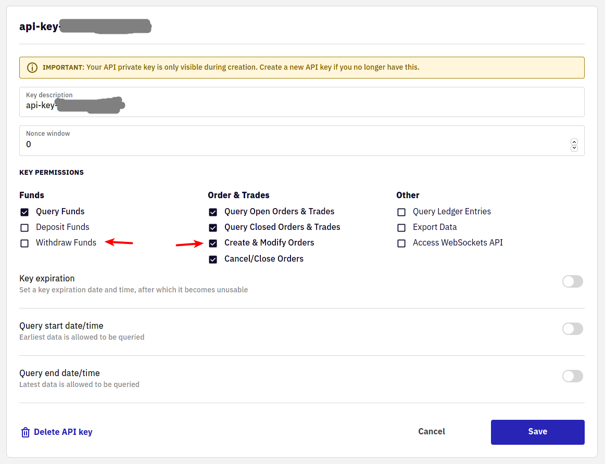
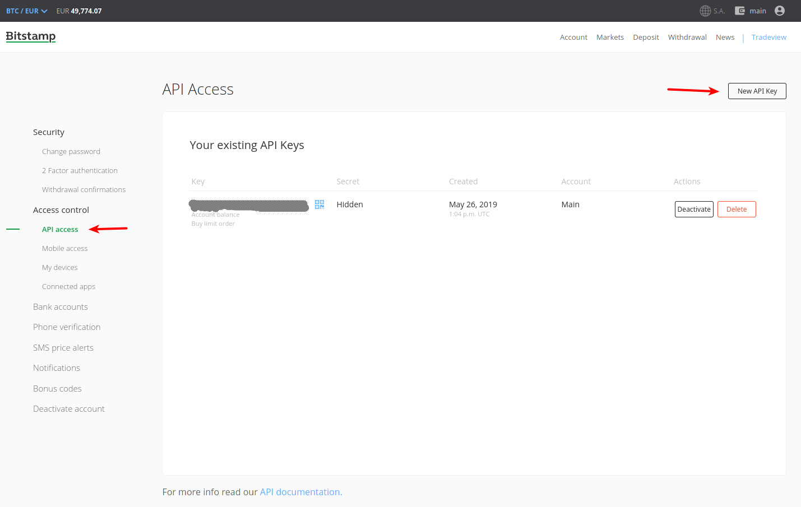

 
# Marketplaces

We currently support two marketplaces, [Bitstamp](https://bitstamp.net/) and [Kraken](https://kraken.com). You only have to configure one of them, but you can also configure both. When you start the program, you can just choose which marketplace you want to use today.

## Kraken

Go to the [Kraken API key page](https://www.kraken.com/u/security/api) and create an API key which has the permission to trade.

There you need to create a new API key:


Be sure to select the _Create & Modify Orders_ permission such that the program can actually execute orders. Give the least amount of permissions, you should not select _Withdraw Funds_ if you don't want to enable the automatic withdrawal feature described below.



You will get an API key and an associated secret. In the configuration file you add a paragraph like the following. The first will be API key and the second will be the secret, like this:

```yaml
kraken:
  key: "YOUR KEY"
  secret: "YOUR SECRET"
```

### Fee policy

When you trade, you will have to pay a certain fee that depends on your Kraken account tier. Whatever these are exactly, you can choose whether you would like to have them taken away from your fiat or coin amount. If you let it take away from your coin amount, buying coin for 50 EUR will only cost exactly that, but you get a bit less coin. Should you rather choose to have it taken in fiat, you will get as much coin as you want, but it will cost you more fiat.

Kraken supports this as a [flag to `addOrder`](https://docs.kraken.com/rest/#operation/addOrder) and has two options:

> - `fcib` prefer fee in base currency (default if selling)
> - `fciq` prefer fee in quote currency (default if buying, mutually exclusive with `fcib`)

As explained [in their glossary](https://support.kraken.com/hc/en-us/articles/115000364388-Trading-glossary), the quote currency is fiat, whereas the base currency is the coin.

We support this choice via the option `prefer_fee_in_base_currency`, which is false by default, so the fee is preferred in quote currency. If you set this to true, you can instead have it in the base currency and only spend exactly as much as you want. For this add this line:

```yaml
kraken:
  …
  prefer_fee_in_base_currency: true
```

### Automatic transfer to wallet

For this marketplace we support automatic transfers to an external wallet when the crypto volume is large enough. We query the current fees and only do the transfer when the fees are below a certain percentage of the value to transfer.

In order to set this up, you first need to have a withdrawal target. Go to the [funding page](https://www.kraken.com/u/funding), click on [withdraw BTC](https://www.kraken.com/u/funding/withdraw?asset=BTC) for example. Then use “Add Address” to create a new address and give it some name. I call mine simply “Wallet”. Then for each currency that you want to set up withdrawal for, add a matching group in the `kraken` section like this:

```yaml
kraken:
  …
  withdrawal:
    BTC:
      target: "Wallet"
      fee_limit_percent: 1.0
```

The API key that you use must have the _Withdraw Funds_ permission.

After each trade the program will check whether you are above the fee limit and start the transfer. This way you can have your marketplace account as empty as you like.

## Bitstamp

In order to use Bitstamp, you need to set up an API key with them that has the correct permissions to trade with. Go to the *settings* menu and create a new key.

> 

Put this API key into the configuration file.

```yaml
bitstamp:
  username: "username here"
  key: "key here"
  secret: "secret here"
```