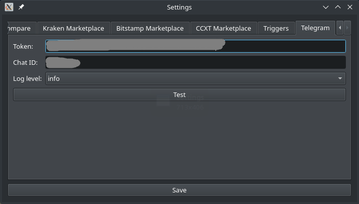

# Notifications

Optionally you can set up notifications via several external services. This is not required, but a nice extra to allow monitoring from anywhere. You can configure zero or multiple notification providers, they will then all be used in parallel.

## Logging level

The `level` specified the messages that you want to receive. `info` gives sensible information, if you only want to receive information when something goes wrong, use `warning`. See the section in [running](../usage/general.md) for more details.

The severity of messages is color-coded with an emoji according to this mapping:

Symbol | Severity
:---: | :---
🔴 | Critical
🟠 | Error
🟡 | Warning
🟢 | Info
🔵 | Debug

The logging level is set to *Info* by default.

## Telegram

One popular choice for notifications is Telegram. First you have to create a bot by talking to [@botfather](https://t.me/botfather). It will lead you through a couple of steps:

1. Type `/start` to initiate the bot creation.
2. Then type `/newbot` to create your bot.
3. It will ask you for the name of the bot. You can just use “vigilant-crypto-snatch” or something else.
4. Next it will ask for a username of the bot. This is a technical thing, so it doesn't need to be pretty. It needs to be unique and end with `bot`. So perhaps use something like `vigilant_0f8704a83991_bot`, where you just make up your own random letters.

It will give you an access token that you can use for the API. Enter that token into the GUI here:



You can click on *Test* to have it send a test message.

In the configuration file you add another paragraph:

```yaml
telegram:
  token: "Your bot token here"
  level: info
```

You will need to write a message to the bot in order to open a direct conversation with it. This is necessary such that the bot can reply to you.

If the Telegram bot token is set up correctly, you will receive messages like this:

> 

## notify.run

The service [notify.run](https://notify.run/) offers free notifications which are very simple to set up. One does not need to register, one can just create a new channel. They recommend to not send private data the service. As I understand it, if somebody was to guess the channel ID (unlikely), they would be able to see all notifications. Also, it is not clear where the data is stored and for how long. 

Go to their website, click on “create a channel”. It will give you a channel ID, which you need to add to the configuration file like so:

```yml
notify_run:
  channel: "…"
  level: info
```

This is not available in the GUI.