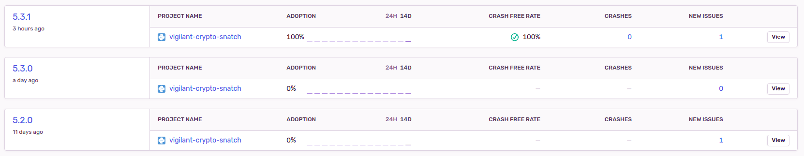
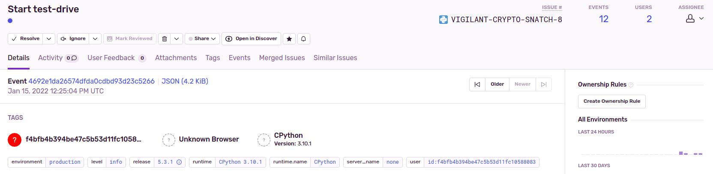
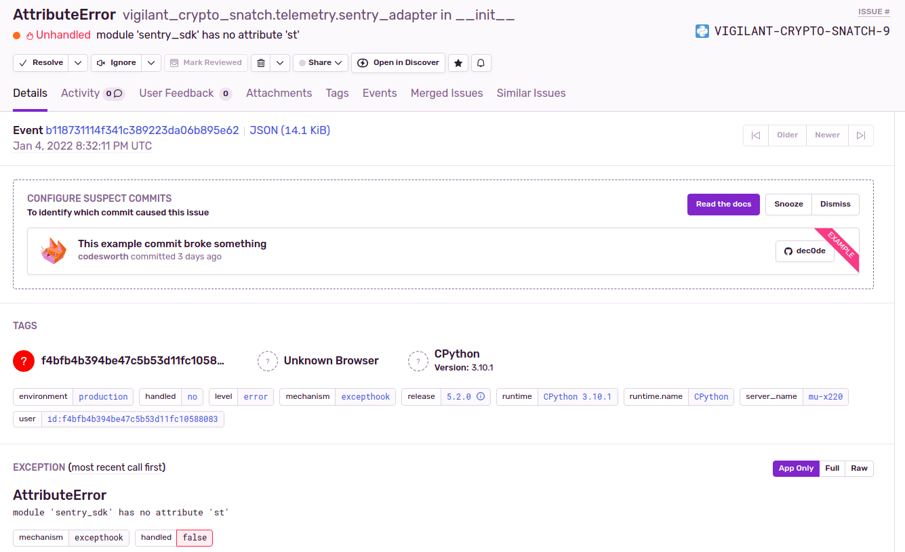

# Telemetry 

It is hard to judge the size of the user base, or which Python or program versions are used. For this it is very tempting to have some sort of telemetry in a software. Yet this is something that software shouldn't just start sending, especially not when it is about finance.

Therefore telemetry is opt-in. You can enable it, if you want to share this information with the developers.

At the moment we use [Sentry](https://sentry.io/) for telemetry, which allows us to track release versions, exceptions and user sessions.

# Configuration

The configuration is simple, just enable it in the configuration file:

```
telemetry:
  collect: true
```

# User ID

Each user gets assigned a unique ID. It is a UUID4, which is complete random and doesn't contain any information about the machine or the user. An example ID is `f29fc46ea1364e5aba6d138398a20ad4`.

It is written to `~/.local/share/vigilant-crypto-snatch/user_id.json` on Linux. When it is deleted, a new random user ID will be created.

# Collected data

Whenever the program is started, it will send a message which contains the currently used version of the program. This can then be seen in an overview over the versions:



This allows to see the adoption rate of new versions.

During startup, a specific message is send about which part of the program is used, say “watch”, “test-drive” or “evaluate”. This way one can see how often these things are actually used.



It logs the user ID, the Python version and the version of this software.

Then there are more details, about the Python version used and the package versions. From the Python version one could also deduce that this is running on a Red Hat or Fedora Linux.


Whenever there are unhandled exceptions, these are also sent to Sentry. This is an example for an older attribute error that I had:



It does say `server_name` there, and has the name of my laptop. This has been fixed, it doesn't send the actual hostname but only “none”, like you can see in the second screenshot.

A traceback is also included, to make debugging easier.

