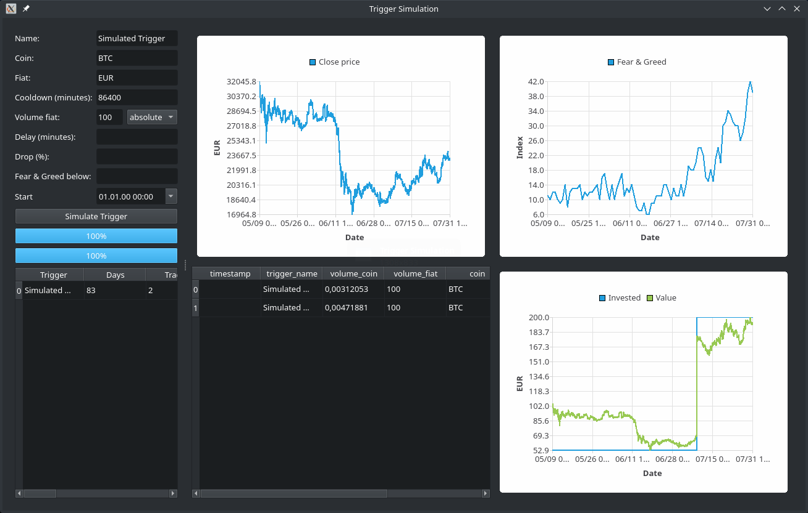

# Getting Started with the GUI

We will start with usage of the graphical user interface (GUI) and show the command line on subsequent pages.

To start the graphical user interface, you have to open a command line (*cmd* on Windows, *Terminal* on Mac) and enter either `vigilant-crypto-snatch-qt` or something like `~/.local/bin/vigilant-crypto-snatch-qt`. After pressing <kbd>Enter</kbd> you will see the main screen:

When you start it up for the first time, the three panels will be empty until you have configured the program. Before going through the details of that, we want to show how the program is used once you have it configured and create some motivation to go through the configuration process.

You have three panels there, *Balances*, *Spot Prices* and *Triggers*. The balances are all balances of relevant currencies on the configured marketplace. You can see that the author has like 52.98 EUR on his account, and no BTC at all. On the left you see the spot prices for all configured currencies. The author only buys BTC, so only that shows up there.

The bottom panel shows the *triggers*. These are rulesets for buying under certain conditions. You can see one trigger per line, and one rule per column. So the first three triggers have cooled down, whereas the fourth has not. But the first three triggers wait for the drop, whereas the fourth has no drop rule.

## Trigger simulation

In order to get a feel for the trigger rules, you can simulate them. We will also take this to explain how the triggers work.

 Use the main menu *Simulation* to open up the simulation window:

On the top left you configure your trigger. It has to have a unique name in order to be identifiable in the database. This name should not be changed, or the cooldown (see next paragraph) will not work. It will work with a certain currency pair, you just enter the regular abbreviations of the currencies.

The first interesting rule is the *cooldown*. We don't want triggers to trigger multiple times in rapid succession, depleting your fiat funds. Therefore they always have a cooldown associated. You can choose it as short as you like.

Next you need to specify how much volume is to be invested. This can either be an *absolute* amount, where in the screenshot it would be 100 EUR. Alternatively you can select the *percentage* variant, and then the value will be a percentage.

The *delay* is an optional setting, which must be set together with *drop*. The idea is that if the price has dropped a certain percentage compared to a reference point, the coin may be undervalued and it is a really good time to buy. If you set the delay to one week, and the percentage to 20 %, it will buy if the price right now is 20 % below the price of one week ago. As one can see in the upper center graph, the price has rapidly fallen from around 29.000 EUR/BTC to around 19.000 EUR/BTC in the course of a few days. That is a drop of 34 % within a few days. But there are also smaller-scale drops, which might also be interesting to invest in.

The [*Fear & Greed index*](https://alternative.me/crypto/fear-and-greed-index/) is a market sentiment estimation, which ranks from 0 (pure fear) to 100 (extreme greed) and basically means whether the coin is undervalued or overvalued. This not only takes into account the price itself, but also some other information sources. This can also be used as an additional rule.

Sometimes one doesn't want a trigger to start right away. One can use the *start* attribute to delay it into the future. If one sets it to some value in the past, it is effectively unset.

You can combine the additional rules for *drop*, *fear & greed* and the *start* freely. If you don't specify any additional rules, you end up with a plain *dollar cost average* where you buy coins whenever the cooldown finishes.

Once you have put in the parameters, you can simulate the triggers. You can see a table of the purchases in the bottom center. Each trigger execution is one line in the table. The bottom right graph shows the money invested as well as the value of the investment at the given point in time. The bottom left table shows a summary of each simulation. This way you can run a bunch of simulations and still compare to previous runs.

## Log messages

In case you experience strange things, have a look into the log messages via the *Help* menu. There you find the latest log messages at the bottom.

Consider copying these error messages when you report a bug.

## Version information

In case you want to know which version is installed, you can click on *About* in the *Help* menu to see the version:

A link to this online documentation is also included.

## Trades overview

Once you have the program configured and running for a while, you can see your trades in the overview panel. Go to *Report* and select the trade report:

This lists the amount of fiat you spend, how much coin you got, which trigger executed that trade, and how much the current value of that coin is. In this screenshot you can see how the author has bought close to the all time high, and the value has fallen dramatically, resulting in a severe loss if sold at that point in time.