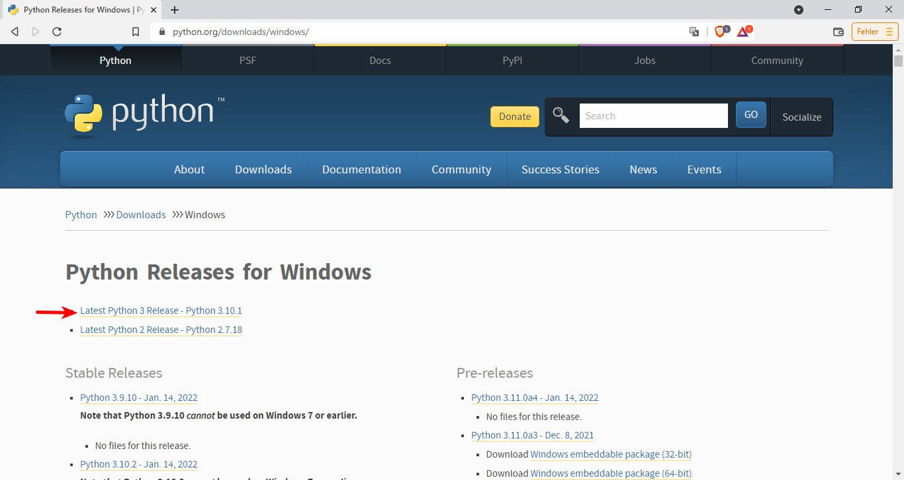
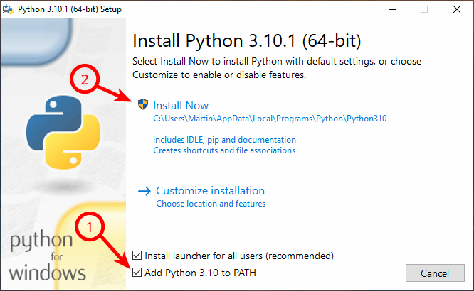
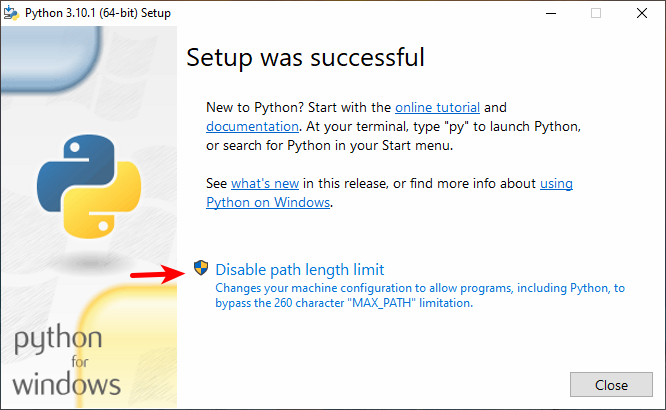
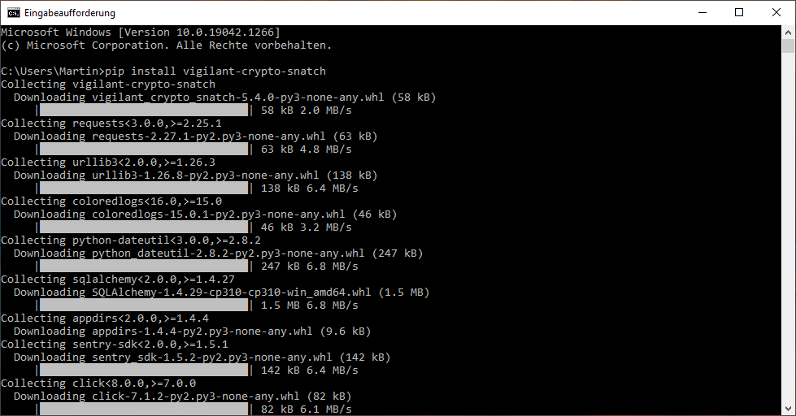

# Installation

This program is implemented in Python, so you will have to install the Python interpreter first. We will show you the necessary steps for your platform.

The way to install Python on Windows, Mac and Linux are completely different, we are going through the different systems one by one. You can use the navigation to directly jump to your platform, if you want. We also need to install different parts of this project on the platforms, so we have structured it directly by platform.

## On Windows

For Windows, you can download Python via the [Python website](https://www.python.org/downloads/windows/):



Then download the Windows Installer for 64-Bit:


Launch the installer, and add Python to the PATH. This will make it easier later on.



Then just press “Install Now”.

After the setup has gone through, it will allow you to extend the command line limit. This might be necessary, I would just do that.



Then you are finished and have Python installed on your system. We can then proceed to install the program.

Then open a command line by pressing <kbd>Windows</kbd> and type “cmd” to launch the command line. You will see a window like this:


Then type `pip install 'vigilant-crypto-snatch[evaluation,gui]'` and press <kbd>Enter</kbd>. It will start to download the latest version of the program:



Eventually it will finish and show you the command line again:


You should be able to start `vigilant-crypto-snatch` without arguments by typing that now:


If you get this help screen, then everything is installed correctly.

## On Mac

On the Mac, use Spotlight to open the *Terminal* application. Then just type `python3`. A dialog window should open and ask you to install some developer tools. Do that, and you should have Python installed.

Once this is installed, you can install it by typing `pip install 'vigilant-crypto-snatch[evaluation,gui]` at the command prompt. It should download the program.

## On Linux desktop or laptop

Major Linux distributions directly ship with Python, so you don't need to install the Python interpreter yourself, it is already there.

All you need to do is to open a terminal type `pip install 'vigilant-crypto-snatch[evaluation,gui]`. This will install the project for your user only.

You have to make sure that `~/.local/bin` is part of your `PATH` environment variable such that you can start the program.

If you want to install it for all users into the system path, you can also prepend a `sudo` to the command line. This way it will be installed into `/usr/local/bin` and you don't have to worry about the path.

## On Raspberry Pi

Raspbian, the Debian variant for the Raspberry Pi, already has Python installed. Do you just need to install this program here.

To install the program, open a terminal and type `pip install 'vigilant-crypto-snatch`. This will install the project for your user only. Because the ARM architecture is not supported by the PySide6 library, you cannot use the GUI on the Raspberry Pi.

You have to make sure that `~/.local/bin` is part of your `PATH` environment variable such that you can start the program.

If you want to install it for all users into the system path, you can also prepend a `sudo` to the command line. This way it will be installed into `/usr/local/bin` and you don't have to worry about the path.

## Upgrades

If you want to upgrade to the latest version, use:

```bash
pip install 'vigilant-crypto-snatch[evaluation,gui]' --upgrade
```

In case you have installed it differently, you will likely also need to upgrade in the same way.