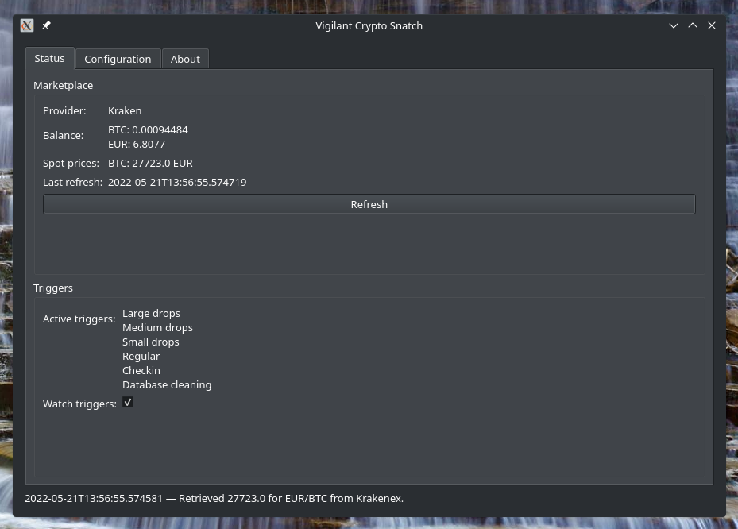

# Graphical User Interface

Since version 5.7.0 we also have a graphical user interface written in Qt. It is still not fully featured and likely still full of little issues. Please use it with this in mind, and report bugs such that this can be improved.

The GUI provides a configuration tab where you can configure all the necessary parts to run the program.

The status screen is still rudimentary but should allow you to run the triggers and therefore have the same feature set as you have with the command line utility.

To start the graphical user interface, run `vigilant-crypto-snatch-qt` from the command line. There is no desktop icon for it, yet.